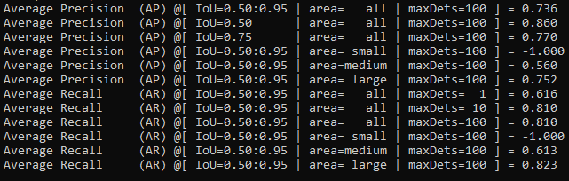

# Training Custom dataset of Playing Cards on EfficientDetD2

The pytorch re-implement of the official [EfficientDet](https://github.com/google/automl/tree/master/efficientdet) with SOTA performance in real time, original paper link: <https://arxiv.org/abs/1911.09070>.

The research done in this paper and the excellent results displayed by the Efficientdets are due to these contributions of the paper:
1. Bi-didrectional Feature Pyramid Network (BiFPN)

These are used for the multiple feature scaling in the network. They have been built upon the Feature Pyramid Network(FPN) and PANet. 

2. Compound Scaling

Compound Scaling was first proposed in the `EfficientNet` paper. It involves increasing the depth/width/resolution of the whole network including the backbone, feature network, class/box network and resolution.

3. EfficientDet

In this paper, we are introduced to the EfficientDet that gice state-of-the-art performance with improved accuracy and efficiency.

I trained the Efficientdet D2 on Playing Cards dataset. The information regarding the dataset, the whole training process and the evaluation results are discussed in the ensuing sections.

## Requirements

    # install requirements
    pip install pycocotools numpy opencv-python tqdm tensorboard tensorboardX pyyaml webcolors
    pip install torch==1.4.0
    pip install torchvision==0.5.0

You can also use conda install if you're using anaconda. 

## Dataset

The Playing Cards dataset was downloaded from kaggle. Link: (https://www.kaggle.com/luantm/playing-card). The classes include nine, ten, jack, queen, king and ace. 

## Preprocessing Dataset

The labels for the dataset were available in the `.xml` format. So, in order to train the data on this implementation, I first had to create the annotations file for this dataset in the `COCO json` format. I used the [VOC2COCO converter](https://github.com/yukkyo/voc2coco). However, I had to make a couple of tweaks to the code to get the accurate format.
Place the xml files in the Annotations(create this folder) folder. Create a txt file contatining the names of the xml files and run `python voc2coco.py Annotations instances_{train/val}.json`. You'll get the annotations in the output json file(instances_train and instances_val).
The category id should start with 1 in this format. That was also implemented in the conversion. 

## Setting up the project

    # your dataset structure should be like this
    datasets/
        -your_project_name/
            -train_set_name/
                -*.jpg
            -val_set_name/
                -*.jpg
            -annotations
                -instances_{train_set_name}.json
                -instances_{val_set_name}.json

    # for example, in our case,
    datasets/
        -project_cards/
            -train/
                -cam_image2.jpg
                -cam_image4.jpg
                -cam_image5.jpg
            -val/
                -IMG_2554.jpg
                -IMG_2555.jpg
                -IMG_2557.jpg
            -annotations
                -instances_train.json
                -instances_val.json

## Setting up project Parameters

Created a `yml` file in the projects folder and specified the path to train set, val set and the annotations. 

## EfficientDet D2

I started with an effort to implement the D6 but after some memory errors and research, I found out that my GPU(2060 super) doesn't have enough memory to run D6. EfficientDet requires a lot of computing power as the coefficient of the effiecientdet increase. 
Therefore, I went with the training on EfficientDet D2. Even on D2, I had to keep the batch_size to 1. 

## Training

The training was set up with pretrained COCO weights [efficientdet-d2.pth](https://github.com/zylo117/Yet-Another-Efficient-Pytorch/releases/download/1.0/efficientdet-d2.pth)

    # train efficientdet-d2 on playing cards dataset 
    # with batchsize 1, learning rate 1e-5 and 200 epochs

    python train.py -c 2 -p project_cards --batch_size 1 --lr 1e-5 --num_epochs 200 --load_weights weightload/efficientdet-d2.pth

You can also set the `--debug True` and the predictions will be saved in the `test` folder. The weights will be saved in `logs/project_cards`. 

### Early Stopping

    # while training, press Ctrl+c, the program will catch KeyboardInterrupt
    # and stop training, save current checkpoint.

### Resume Training

    # If want to resume training from the last checkpoint
    # simply set load_weights to 'last'

    python train.py -c 2 -p project_cards --batch_size 1 --lr 1e-5 --num_epochs 200 --load_weights last

### Training Preview

### Training Completion

By the 150th epoch, the loss started to converge and the learning rate went down to 1e-7(lr scheduler implemented). 

The training was stopped at the 170th epoch. 

## Evaluation

    # eval on project_cards, efficientdet-d2
    
    python project_eval.py -p project_cards -c 2 -w /path/to/your/weights

## My Weights

I have uploaded my weights file: `efficientdet-d2_cards.pth`. So, run

    python project_eval.py -p project_cards -c 2 -w efficientdet-d2_cards.pth

## Evaluation Preview

After the completion of the training, the network recognized the cards with great accuracy and precision. The results( Average Precision and Average Recall) were as follows:

## Predictions Preview
Here is a preview of our predictions.

## Reference
- [zylo117/Yet-Another-EfficientDet-Pytorch](https://github.com/zylo117/Yet-Another-EfficientDet-Pytorch)
 
